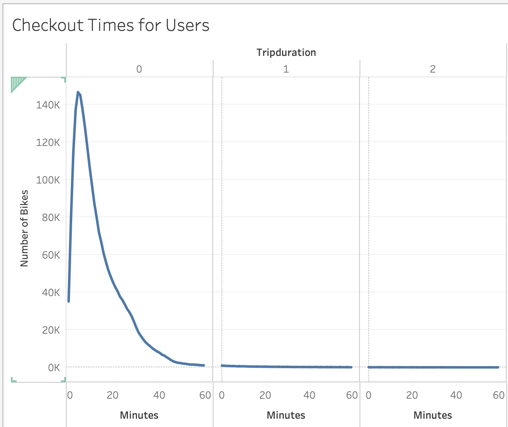
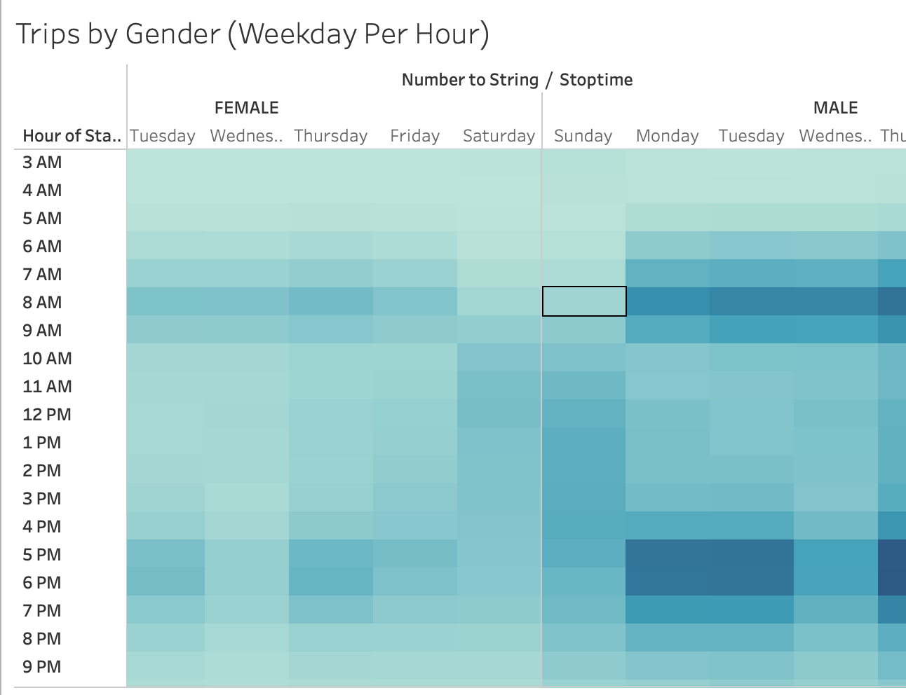
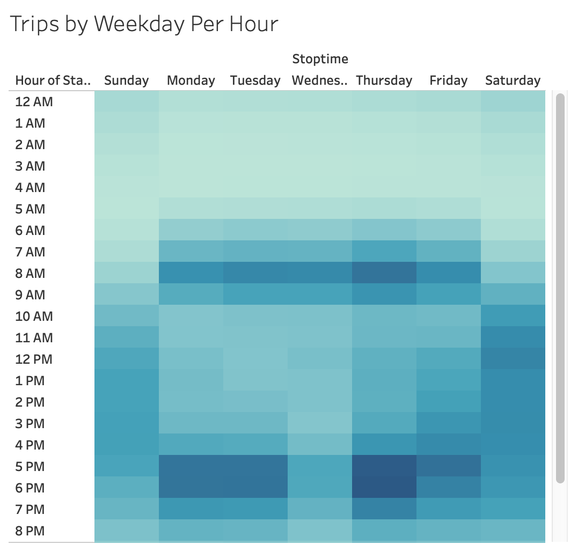
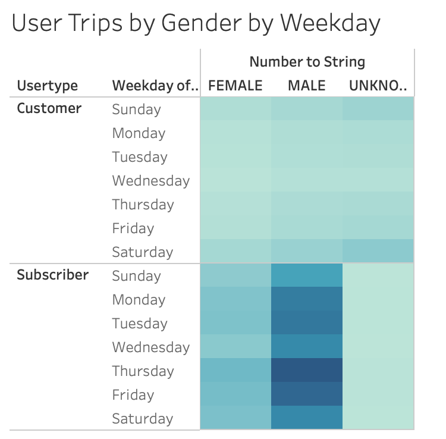
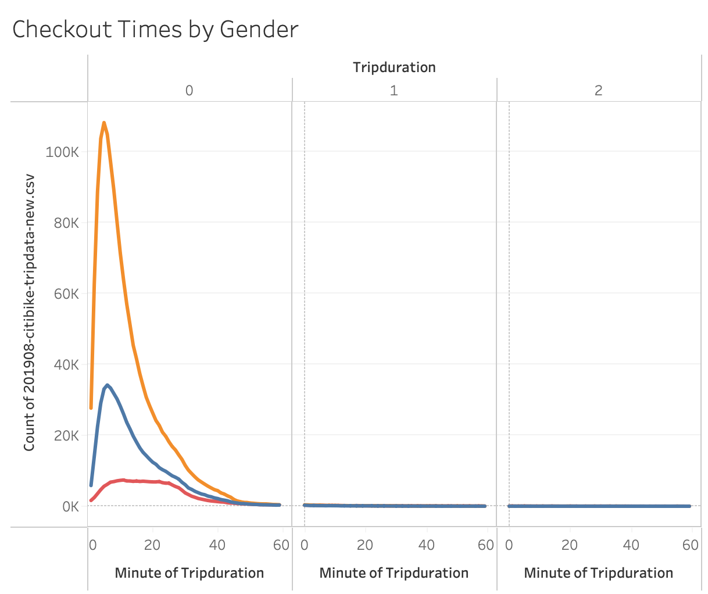

# Bikesharing Analysis

## Overview

The purpose of this project it to take the NYC Citi Bike share data to convince investors that this is a good program to implement in Des Moines. We are providing a bike trip analysis using trip duration, gender, time on bikes, etc to aid in their decision. 

## Results

[link to dashboard - Info by Gender etc](https://public.tableau.com/app/profile/rachel5588/viz/NYCCitiBikeAnalysis-Deliverable/UserTripsbyGenderbyWeekday?publish=yes)

[link to dashboard - Start & Stop Time](https://public.tableau.com/app/profile/rachel5588/viz/NYCCitiBikes_16274871634820/NYCStory?publish=yes)

1) There were 2,344,224 bike trips in August 

2) 1,900,359 users subscribe to the bikeshare program and 443,865 users are customers.

3) Majority of users checkout a bike for around 5-6 minutes. 

4) Majority of the users to checkout bikes are Males (108K male vs 33K female)

5) Majority of bike trips occur in the morning or in the evening, mainly during rushhour/commute times. 

6) We can see that majority of the user types are subscribers, and mainly men. Thursday and Friday seem to be the most popular day to checkout a bike. 

7) When comparing the hourly bike times by gender, we see that men make up the majority of times during popular commute times (8am and 5pm)

## Summary 

Considering the results from the visualizations above, we can see that majority of riders are men, thursday evenings are the most popular times, and majority of users are subscribers to the service. 

Additional suggestions: 
- We should perform this analysis on a different time of year. August will have lots of traffic due to the warm weather, however Winter may be quite dead, and could offset profits. 
- Also could look into the locations of where bikes are taken out, and put back. There may be evidence to suggest adding more bike stations in highly populated commuter suburbs. 

